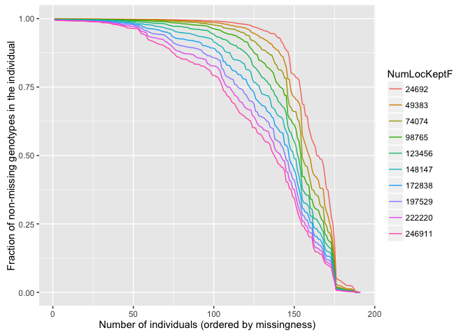
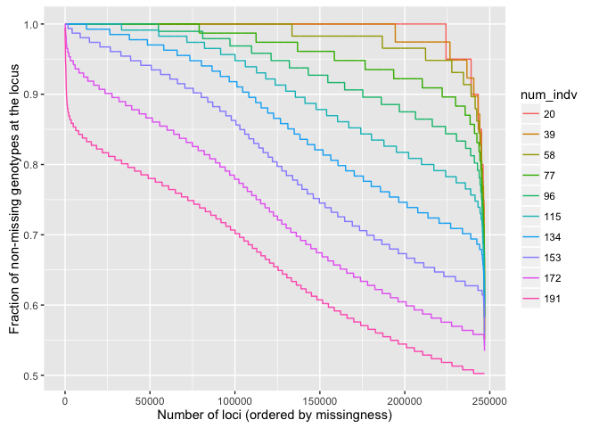
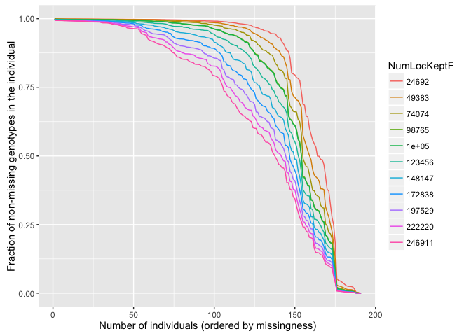
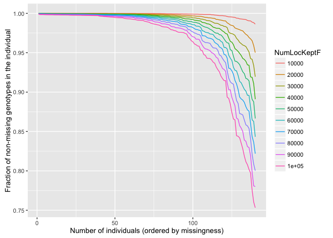
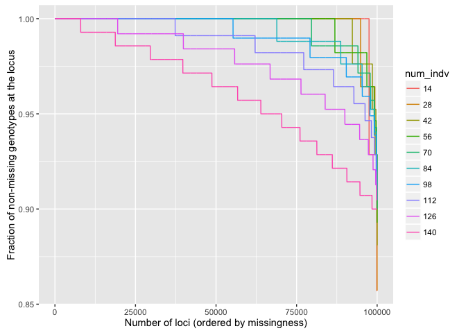
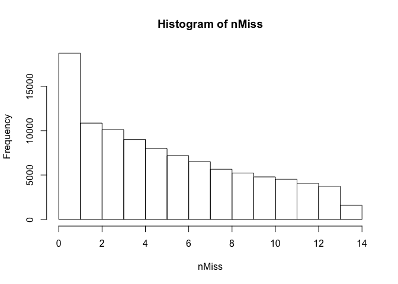
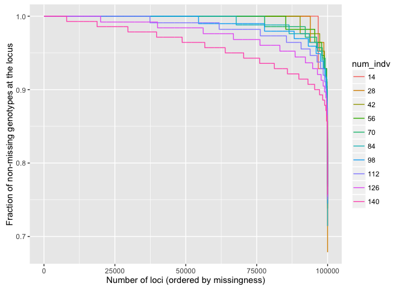
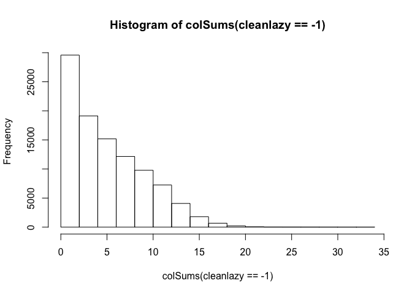

genoscapeRtools
================
08 November, 2016

-   [Example running through missing data visualization](#example-running-through-missing-data-visualization)
    -   [Reading data in](#reading-data-in)
    -   [Doing the missing data calcs](#doing-the-missing-data-calcs)
    -   [Pulling out the data](#pulling-out-the-data)
-   [Read it back in](#read-it-back-in)
    -   [Manually counting up amount of missing data](#manually-counting-up-amount-of-missing-data)
-   [How it was wrong before](#how-it-was-wrong-before)
    -   [Doing it the lazy way](#doing-it-the-lazy-way)

<!-- README.md is generated from README.Rmd. Please edit that file -->
This is an R package of tools in devlopment. At the moment it consists mostly of some utilities for investigating amounts of missing data and visualizing where a good cutoff might be.

Example running through missing data visualization
--------------------------------------------------

We have some data from American Kestrel from Rachael Bay and Kristen Ruegg. There files are `cov0.5m.012`, `cov0.5m.012.indv`, and `cov0.5m.012.pos`. I have put all of those into the directory `~/Documents/UnsyncedData/AMKE` on my computer.

First we gotta load the library:

``` r
library(genoscapeRtools)
```

### Reading data in

There's a function for that

``` r
amke <- read_012(prefix = "~/Documents/UnsyncedData/AMKE/cov0.5m")
#> 
Read 0.0% of 191 rows
Read 191 rows and 246912 (of 246912) columns from 0.103 GB file in 00:00:06
```

### Doing the missing data calcs

We can do this in a locus centric or an individual centric manner. Here we first do it in an indiv-centric way:

``` r
indv <- miss_curves_indv(amke)
indv$plot
```



And in a locus-centric view:

``` r
loci <- miss_curves_locus(amke)
loci$plot
```



### Pulling out the data

So, in theory, if we look at this and decide that we want to keep 140 individuals and roughly 100,000 positions, we should be able to do so in such a way that we have no individuals with more than about 25% missing data, and no loci that should have more than say 10% missing data.

Let's see:

``` r
clean <- miss_curves_indv(amke, clean_pos = 100000, clean_indv = 140)
#> Picking out clean_pos and clean_indv and writing them to cleaned_indv140_pos1e+05.012
```

Make a picture of the result:

``` r
clean$plot
```



Read it back in
---------------

Read the thing back in:

``` r
amke2 <- read_012("cleaned_indv140_pos1e+05")
```

Then plot things

``` r
indv2 <- miss_curves_indv(amke2)
indv2$plot
```



And by locus:

``` r
loci2 <- miss_curves_locus(amke2)
loci2$plot
```



That looks pretty good. It is right at about 10% missing data, which is were it should be at.

### Manually counting up amount of missing data

We can go ahead and count up the fraction of missing data at each locus. First, just to remind us what format this is in, let's look at the total proportion of missing:

``` r
table(amke2) / length(amke2)
#> amke2
#>         -1          0          1          2 
#> 0.03836879 0.73816636 0.15066421 0.07280064
```

That is almost 4% missing data overall. Now we can look at the fraction of missing data at each locus

``` r
nMiss <- colSums(amke2 == -1)
hist(nMiss)
```

 And that looks about right.

How it was wrong before
-----------------------

Before Rachael caught a bug here, with `clean_pos` and `clean_indv` I was picking out the top individuals, but I was being lazy when picking out the top loci to go with them. Instead of picking out the top loci for those particular top individuals, I was just picking out the loci with the least missing data across all the individuals. So, random variation with 100K chances being what it is, that old, lazy method landed us with a tiny handful of loci that didn't have relatively very much missing data in all individuals, but somehow still had up to 25% missing data at the particular `clean_indv` top individuals.

Before I deprecate it and remove it, there is an option. `indv_specific_clean_pos`, to `miss_curves_indv` that lets you see the results of the old lazy way.

### Doing it the lazy way

``` r
lazy <- miss_curves_indv(amke, clean_pos = 100000, clean_indv = 140, indv_specific_clean_pos = FALSE, clean_file_prefix = "lazy")
#> Picking out clean_pos and clean_indv and writing them to lazy_indv140_pos1e+05.012
```

Then read it back in:

``` r
cleanlazy <- read_012("lazy_indv140_pos1e+05")
```

``` r
miss_curves_locus(cleanlazy)$plot
```

 Yep, that shows that disturbing tail.

Look at at it another way:

``` r
hist(colSums(cleanlazy == -1))
```


